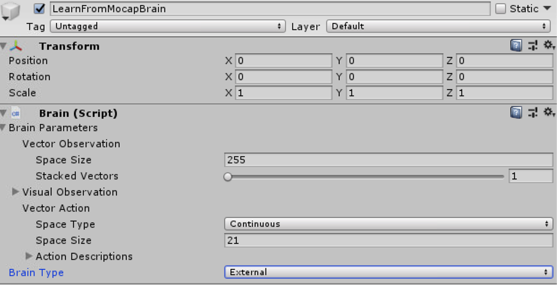

# ActiveRagdollStyleTransfer
Research into using mocap (and longer term video) as style reference for training Active Ragdolls / locomotion for Video Games

(using Unity ML_Agents + [MarathonEnvs](https://github.com/Unity-Technologies/marathon-envs))

----

#### Goals
* Train active ragdolls using style reference from MoCap / Videos
* Integrate with [ActiveRagdollAssaultCourse](https://github.com/Sohojoe/ActiveRagdollAssaultCourse) & [ActiveRagdollControllers](https://github.com/Sohojoe/ActiveRagdollControllers) 

----

#### Using this repo
* To install, check the instructions in the folder ml-agents/Readme.md
* Make sure you are using a compatible version of Unity (last tested with 2019.1)
* To run trained models, make sure you: [add TensorFlowSharp to Unity](https://github.com/Unity-Technologies/ml-agents/blob/master/docs/Using-TensorFlow-Sharp-in-Unity.md). 
The package can be downloaded from [this link](https://s3.amazonaws.com/unity-ml-agents/0.5/TFSharpPlugin.unitypackage)

* To try different moves: Replace reference MoCap in animation tree and select the right ML-Agent trained model
* To re-train:
  * Set the `LearnFromMocapBrain` to External 
  * Build the project
  * From the root path, invoke the python script like this: `mlagents-learn config\style_transfer_config.yaml --train --env="\b\StyleTransfer002\Unity Environment.exe"  --run-id=StyleTransfer002-145` where `"\b\StyleTransfer002\Unity Environment.exe"` points to the built project and `StyleTransfer002-145` is the unique name for this run. (Note: use `/` if on MacOS/Linux)
  * See the [ML-Agents documentation](https://github.com/Unity-Technologies/ml-agents) for more details on using ML-Agents
* Notice the walker and the runner are trained with an older version of Unity, so they will not work straight away in Unity 2019.1, mainly due to the fact that PhysX has changed. Retraining these should work, though

* Post an Issue if you are still stuck

----

#### Contributors
* Joe Booth ([SohoJoe](https://github.com/Sohojoe))

----

#### Download builds : [Releases](https://github.com/Sohojoe/ActiveRagdollStyleTransfer/releases/)

----

## StyleTransfer002

Backflip (002.144-128m steps) |
--- | 
 | 

| Running (002.114) | Walking (002.113) | 
--- | ---- |
 |  | 

* **Model:** MarathonMan (modified MarathonEnv.DeepMindHumanoid)
* **Animation:** Runningv2, Walking, Backflip
* **Hypostheis:** Implement basic style transfer from mo-cap using MarathonEnv model
* **Outcome:** Is now training on Backflip
  * Initial was able to train walking but not running (16m steps / 3.2m observations)
  * Through tweaking model was able to train running (32m steps / 6.4m observations)
  * Was struggling to train backflip but looks like I need to train for longer (current example is 48m steps / 9.6m observations)
  * Was able to train Backflip after updating to Unity 2018.3 beta - looks like updates to PhyX engine improve stability
* **References:** 
  * Insperation: [DeepMimic: Example-Guided Deep Reinforcement Learning of Physics-Based Character Skills arXiv:1804.02717 [cs.GR]](https://arxiv.org/abs/1804.02717)
* **Notes:**
  * Needed to make lots of modifications to model to improve training performance
  * Added sensors to feet improved trainging
  * Tweaking joints improved training
  * Training time was = ~7h for 16m steps (3.2m observations) **TODO: check assumptions**
  * New Training time is + 2x
  * ... Optimization: Hack to Academy to have 4 physics only steps per ml-step
  * ... Optimization: Train with 64 agents
  * ... also found training in headless mode --no-graphics helped
  * **Updated to Unity 2018.3 Beta for PhysX improvements** 
  * see [RawNotes.002](RawNotes.002.md) for details on each experiment

## StyleTransfer001

* **Model:** U_Character_REFAvatar
* **Animation:** HumanoidWalk
* **Hypostheis:** Implement basic style transfer from mo-cap
* **Outcome:** FAIL
  * U_Character_REFAvatar + HumanoidWalk has an issue whereby the feet collide. The RL does get learn to avoid - but it feels that this is slowing it down
* **References:** 
  * Insperation: [DeepMimic: Example-Guided Deep Reinforcement Learning of Physics-Based Character Skills arXiv:1804.02717 [cs.GR]](https://arxiv.org/abs/1804.02717 
* **Raw Notes:**
  * Aug 27 2018: Migrate to new repro and tidy up code so to make open source

