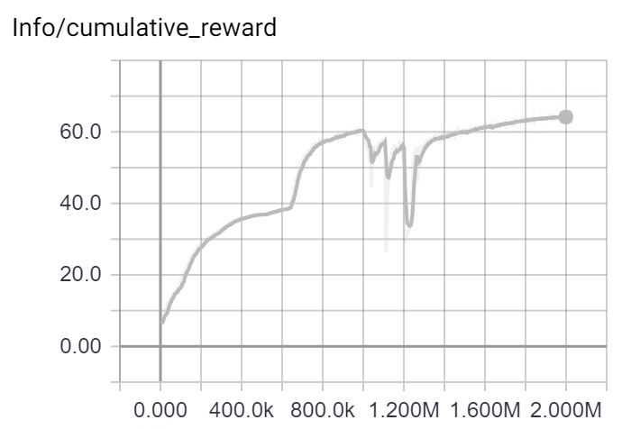
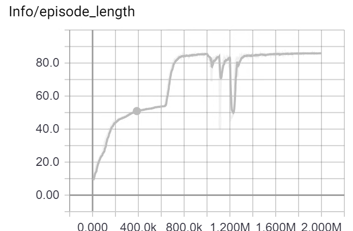
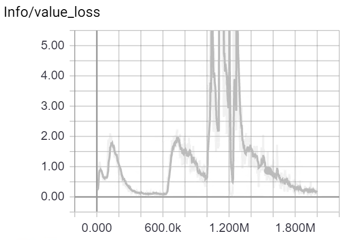

These are my raw notes from each training run

* 002.143 - backflip (StyleTransfer002) - **Finally completes backflip!!! needed 128m training steps**

| Reward | EpisodeLenght | ValueLoss |
|--|--|--|
|  |   |   | 
Trained with 64 agents (so 128m training steps)
Trained in 3 phases. 1 was 32m, then 32m, then 64m

* … **test using Unity 2018.3 beta using my default hyperparms**
* 002.142 - gamma: 0.995 (was .99)
* 002.142 - gamma: 0.98 (was .99) - seams closer to 
* 002.141 - trained almost as good as 
* … by mistake, buffer_size: 4096, batch_size: 1024
* … optimize by only running action / any ml-agents logic 1 in 5 times
* Tried OpenAI Baselines PPO2 but did not figure out right hyperparams or see improvement in training time. Found GPU was slower than CPU???
* Tried  hidden_units: 1024 (was 512) - didn’t show any improvement
* 002.138 - backflip (StyleTransfer002) 
* … curriculum learning 50% at .8, then 0.0
* 002.137 - backflip (StyleTransfer002) start frame 0,  =
* … hidden_units: 1024 (was 512)
        * … time_horizon: 100 (was 50) 
* 002.136 - backflip (StyleTransfer002) start frame 0 = 
* … abort if distanceReward < 0.25f (was 0.33)
* 002.135 - backflip (StyleTransfer002) with random trainer = 32m - so so, better than 133 but not as good as 134; will keep training both
* 002.134 - backflip (StyleTransfer002) start frame 1 = 32m - **is working best so far**
* … abort if distanceReward < 0.334f (was 0.18f)
* 002.133 - backflip (StyleTransfer002) with random trainer = aborts out of backflip, try more aggressive distanceReward abort
* 002.132 - runningv2 (StyleTransfer002) with random trainer  = trains well after 32m sim steps, train for more
* … revert early terminate during training after 50 steps
* … reset if reward < 0.18 or torso, head, bum hit ground
* 002.130 = backflip (StyleTransfer002) with random trainer = not great, seams really wobbly, not sure the 50 steps thing is working out so well
* … StyleTransfer002TrainerAgent ignores skipped frames (so backflip goes from 430 to 83 frames)
* … time_horizon: 50 (was 1000)
* … turn jointAtLimitPenality into jointsNotAtLimitReward 
* 002.129 = backflip (StyleTransfer002e) normal batch size = hard to tell
* 002.128 = backflip (StyleTransfer002f) 1/4 batch size = doesn’t do well
* .. 64 agents
* 002.127 = backflip (StyleTransfer002e) with random trainer = 
* 002.126 = backflip (StyleTransfer002f) = not sure
* … early terminate during training after 50 steps
* 002.125 = backflip (StyleTransfer002e) = not sure
* … reset if reward < 0.18
* 002.124 = backflip (StyleTransfer002f) )
* … trainerAgent does not reset on done = Same, takes easy way out of backflip
* 002.122 = backflip (StyleTransfer002e) ) = OK, but takes easy way out of backflip so that he stands for longer
* … rework reward so never negative 
* 002.121 = backflip (StyleTransfer002e) (minor tweak) = is learning to fail as this is higher reward than negatives
* 002.120 = backflip (StyleTransfer002e) = NOT WORKING 
* … TrainerBrain - Adversarial network to choose where to focus training
* 002.119 = jazzDance (StyleTransfer002d) = 
* 002.118 = MMAKick (StyleTransfer002b) = 
* 002.117 = backflip (StyleTransfer002a) = 
* … remove clip on reward
* 002.116 = backflip (StyleTransfer002d) -1 on fail (was -100) = TBD
* 002.115 = backflip (StyleTransfer002c) = TBD needs more training steps
* 002.114 = runningv2 (StyleTransfer002b) = **Trains well**
* 002.113 = walking (StyleTransfer002) = **Trains well**
* … fix AnimationBase and MarathonMan referenced shin in Agent2
* 002.112 = backflip (StyleTransfer002c) = 
* 002.111 = runningv2 (StyleTransfer002b) = 
* 002.110 = walking (StyleTransfer002) = training better, but strange problem with Agent02
* … fixed Muscle002 apply force to use max of XY (was average which did not work so well when one was 0)
* 002.109 = backflip (StyleTransfer002c) = ok but not as good as 106, something is not right
* 002.108 = runningv2 (StyleTransfer002b) = ok but not as good as 105, something is not right
* 002.107 = walking (StyleTransfer002) = ok but not as good as 104, something is not right
* … make all non-arm joints use one joint
* 002.106 = backflip (StyleTransfer002c) = statistically improves but still not training
* 002.105 = runningv2 (StyleTransfer002b) = trains well, best ever
* 002.104 = walking (StyleTransfer002) = trains really well
* … make feet use one joint (2 axis)
* 002.103 = walking (StyleTransfer002) =
* … tweak foot rotations and power
* 002.102 = walking (StyleTransfer002e) =
* … foot as two joints in one
* 002.101 = walking (StyleTransfer002d) =
* … tweaked humanoid
* 002.100 = backflip (StyleTransfer002c) = 1m signs of training but a long way to go
* 002.099 = running (StyleTransfer002b) = **2m trains a little, needs random inference, bad feet choices**
* 002.098 = walking (StyleTransfer002) = **2m trains well after - but feet are still floppy**
* … fix - reduce bounce on spawn
* 002.097 = running (StyleTransfer002c) always start at beginning =
* 002.096 = running (StyleTransfer002b) = 
* 002.095 = walking (StyleTransfer002) =
* … fix - nest children
* 002.094 = running (StyleTransfer002c) always start at beginning =
* 002.093 = running (StyleTransfer002b) = 
* 002.092 = walking (StyleTransfer002) =
* … fix - velocaties / rotationVelocity where bleeding past reset
* 002.091 = running (StyleTransfer002b) -300 penalty, time_horizon: 64 (was 1000)
* 002.090 = running (StyleTransfer002b) -300 penalty, time_horizon: 128 (was 1000)
* 002.089 = running (StyleTransfer002b) -300 penalty = 
* 002.088 = running (StyleTransfer002b) = 1m: seams about the same
* 002.087 = walking (StyleTransfer002) = 1m: seams about the same
* … add  sensorReward comparing differences in sensor states
* … now 3 sensors per feet
* 002.086 = walking (StyleTransfer002d) = 100 early exit, no done reward, train for 5m / 80m steps = doesn’t train well
* 002.085 = running (StyleTransfer002) = 100 early exit, no done reward, train for 5m / 80m steps = trains ok, feel are still a problem. Not sure any improvement over previous attemtps 
* 002.084 = running (StyleTransfer002c) = -100 early exit, add 10 for complete reward, reduce velocity to 0f
* 002.083 = running (StyleTransfer002c) = -10 early exit, add 10 for complete reward, reduce velocity to 0f
* 002.082 = running (StyleTransfer002b) = remove early exit reward, add 10 for complete reward, reduce velocity to 0f
* 002.081 = running (StyleTransfer002) = remove early exit reward, add 10 for complete reward, reduce velocity to * 0.03
* 002.080 = running (StyleTransfer002c) = remove early exit reward, add 10 for complete reward
* 002.079 = walking (StyleTransfer002b) = remove early exit reward
* 002.078 = running (StyleTransfer002) = remove early exit reward
* … fix runningv2 animation
* 002.077 = running (StyleTransfer002b) =  tweak rewards, remove early exit reward
* 002.076 = walking (StyleTransfer002) = tweak rewards, remove early exit reward
* 002.075 = running (StyleTransfer002b) = revert
* 002.074 = walking (StyleTransfer002) = revert
* 002.073 = walking (StyleTransfer002c) = new normalize, no clamp
* 002.072 = walking (StyleTransfer002b) = new normalize, clamp after square and scale
* 002.071 = walking (StyleTransfer002) = new normalize, clamp between square and scale
* 002.070 = walking (StyleTransfer002d) = new normalize, clamp before square and scale
* 002.069 = walking (StyleTransfer002c) 
* 002.068 = backflip (StyleTransfer002b) 
* 002.067 = runningv2 (StyleTransfer002)
* … try removing reward for early termination or reaching end
* 002.066 = walking (StyleTransfer002c) 
* 002.065 = backflip (StyleTransfer002b) 
* 002.064 = runningv2 (StyleTransfer002)
* .. fix spawn bug
* 002.063 = runningv2 (StyleTransfer002) … non square values … buffer_size: 20480
* 002.062 = walking (StyleTransfer002b) … non square values … buffer_size: 10240
* 002.061 = walking (StyleTransfer002b) … non square values
* 002.060 = runningv2 (StyleTransfer002) … non square values - ABORTED
* …  buffer_size: 4096 was 10240
* 002.059 = walking (StyleTransfer002d) … buffer_size: 4096 was 10240
* 002.058 = walking (StyleTransfer002c) … square values (not average)
* 002.057 = backflip (StyleTransfer002b) … square values (not average)
* 002.056 = runningv2 (StyleTransfer002) … square values (not average)
* … tweak observations
* 002.055 = runningv2 (StyleTransfer002) … square values (not average)
* 002.054 = walking (StyleTransfer002d) … square values (not average)
* 002.053 = walking (StyleTransfer002c) … non square values (as average)
* 002.052 = walking (StyleTransfer002b) … remove average
* 002.051 = walking (StyleTransfer002)
* .. tweak rewards
* 002.050 = runningv2 (StyleTransfer002b)
* 002.049 = walking (StyleTransfer002)
* … fix obs
* 002.048 = runningv2 (StyleTransfer002b)
* 002.047 = walking (StyleTransfer002)
* … redo differences 
* 002.046 = walking (StyleTransfer002c)
* 002.045 = walking (StyleTransfer002c)
* … terminate on end function
* 002.044 = runningv2 (StyleTransfer002b)
* 002.043 = walking (StyleTransfer002)
* … alt ObsAngleDeltaFromAnimationRotation + add angleDist for end effector
        ObsAngleDeltaFromAnimationRotation = 
            Mathf.Abs(_animationRotation.x - rotation.x) +
            Mathf.Abs(_animationRotation.y - rotation.y) +
            Mathf.Abs(_animationRotation.z - rotation.z) +
            Mathf.Abs(_animationRotation.w - rotation.w);
* Note: feet are main problem. Could try recording / comparing sensors. 
* Note: paper is not so clear on how they calculate angle difference - could try alt formula 
* 002.042 = walking, power * 1 (StyleTransfer002c) Try magnitude (was SqrMagnitude) for differences + clamp at -3 = Not as robust as 002.035, slower to learn, can not keep up with example mode.
* 002.041 = walking, power * 1 (StyleTransfer002b) Try magnitude (was SqrMagnitude) for differences + clamp at -2 = Not as robust as 002.035,
* 002.040 = walking, power * 1 (StyleTransfer002b) Try magnitude (was SqrMagnitude) for differences
* 002.039 = JazzDancing * 1 (StyleTransfer002e) = Training SOSO
* 002.038 = Greeting * 1 (StyleTransfer002d) = Training OK
* 002.037 = walking, power * 3 (StyleTransfer002c) = no major benefit over 035
* 002.036 = walking, power * 2 (StyleTransfer002b) = no major benefit over 035
* 002.035 = walking, power * 1 (StyleTransfer002) = Training OK, try 5m
    * **2m trained well**
    * 5m looked like training barfed at 4.8m steps - final model does not work
    * … overall does not look like 5m is much better than 2m
* Default now uses: sensors + clamp -1/1 + termination signal at <-1 + buffer_size: 10240 (was 20480)
* 002.034 = running, power * 2 (StyleTransfer002b) + sensors + clamp -1/1 + termination signal at <-1 + buffer_size: 10240 (was 20480) = 
* 002.033 = running, power * 3 (StyleTransfer002d) + sensors + clamp -1/1 + termination signal at <-1 + buffer_size: 10240 (was 20480) = BETTER THAN 032
* 002.032 = running, power * 3 (StyleTransfer002) + sensors + clamp -1/1 + termination signal at <-1 = IMPROVED by 2x
* 002.031 = running, power * 3 (StyleTransfer002d) + sensors + clamp -1/1 + termination signal at <0 & <-1 - FAILED?
* 002.030 = running, power * 3 (StyleTransfer002c) + sensors + clamp -1/1 = NO CHANGE
* … Mathf.Clamp(poseReward, -1f, 1f);
* 002.029 = running, power * 3 (StyleTransfer002b) + sensors = NO CHANGE
* … remove updated reward & termination
* 002.028 = running, power * 3 (StyleTransfer002e) + sensors + updated reward & termination - FAILED to learn
* … shouldTerminate = terminateSignals >= 1
* 002.027 = running, power * 3 (StyleTransfer002d) + sensors + updated reward - FAILED to learn
* … remove mode observations (not sure these are help as they are)
* … created foot / toe sensors
* 002.026 = running, power * 3 (StyleTransfer002d) + some model observations + updated reward - ABORTED
* … Updated reward = removed the reward clipping per observation (was 0 to 1)
* 002.025 = running, power * 3 (StyleTransfer002d) + some model observations - ABORTED
* 002.024 = backflip, power * 3 (StyleTransfer002c) - TO CHECK
* 002.023 = mmaKick, power * 3 (StyleTransfer002b) - TO CHECK
* 002.022 = running, power * 3 (StyleTransfer002) - did best, testing over 5m - kept improving up to 4.6m then lost performance; used 4.5m steps as test - TO CHECK
* 002.021 = running, power * 2 (StyleTransfer002c) - did better, try x3
* 002.020 = running, power * 1.3 (StyleTransfer002b) - did a little better
* 002.019 = running, power * 1 (StyleTransfer002)
* 002.018 = MMA Kick, power * 1
* 002.016 = running, power * 1